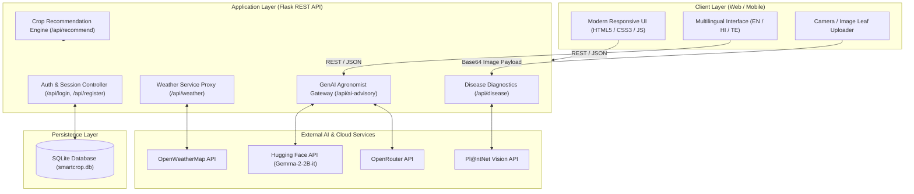

<div align="center">

# 🌱 SmartCrop Advisory System

### *Next-Generation Precision Agriculture & Agronomic Intelligence Platform*

[](https://www.python.org/)
[](https://flask.palletsprojects.com/)
[](https://www.sqlite.org/)
[](https://developer.mozilla.org/en-US/docs/Web/HTML)
[](https://developer.mozilla.org/en-US/docs/Web/CSS)
[](https://developer.mozilla.org/en-US/docs/Web/JavaScript)
[](https://www.jenkins.io/)

[](LICENSE)
[](#)
[](#-contributing)
[](https://github.com/mohammedsalman080405-spec/SmartCropAdvisorySystem/stargazers)
[](https://github.com/mohammedsalman080405-spec/SmartCropAdvisorySystem/network/members)
[](https://github.com/mohammedsalman080405-spec/SmartCropAdvisorySystem/issues)

<p align="center">
  <strong>An end-to-end AgriTech platform empowering rural and commercial farmers with real-time crop suitability scoring, computer vision disease identification, hyper-local weather alerts, and multilingual GenAI agronomy advisory.</strong>
</p>

[Key Features](#-key-features) • [System Architecture](#-system-architecture) • [Tech Stack](#-tech-stack) • [Project Structure](#-project-structure) • [Installation & Quickstart](#-installation--quickstart) • [Configuration](#-configuration--environment-variables) • [API Documentation](#-api-documentation) • [CI/CD](#-cicd-pipeline) • [Contributing](#-contributing)

</div>

---

## 📌 Executive Summary

Modern agriculture faces unprecedented climate volatility, localized soil degradation, and emerging crop pathologies. **SmartCrop Advisory System** bridges the gap between complex agronomic science and on-the-ground farming operations. 

By unifying **soil chemistry, real-time meteorological conditions, computer vision diagnostics, and multilingual Large Language Models (LLMs)**, SmartCrop equips farmers with actionable, data-backed decisions that optimize crop yield, reduce chemical misapplication, and boost farm profitability.

---

## 🚀 Key Features

### 🌾 1. Precision Crop Recommendation Engine
- **Multi-Parameter Agronomic Matcher**: Evaluates real-time temperature, relative humidity, and soil pH against calibrated agronomic threshold profiles for staple and cash crops (Rice, Wheat, Maize, Potato, Tomato, Cotton, Soybean, Sugarcane).
- **Normalized Match Scoring**: Ranks crops on a 10-point confidence scale with clear suitability indices.

### 🔍 2. Computer Vision Crop Disease Diagnosis
- **Leaf Pathology Classification**: Farmers can upload or capture leaf imagery directly in the dashboard.
- **Pl@ntNet Vision API Integration**: Leverages deep learning models to identify pathogens, pests, and deficiencies.
- **Actionable Remediation**: Delivers immediate risk ratings (High / Medium / Low), top diagnostic matches, and practical field management recommendations.

### 🌦️ 3. Hyper-Local Weather Intelligence
- **OpenWeatherMap Integration**: Live ambient temperature, humidity, atmospheric pressure, and weather descriptions based on geographic location.
- **Agronomic Risk Rules**: Flags adverse conditions (heat stress >35°C, chill hazards <15°C, drought conditions <40% humidity) and provides timely irrigation warnings.

### 🤖 4. Multilingual Generative AI Agronomist
- **State-of-the-Art LLM Integration**: Powered by Hugging Face Inference (`google/gemma-2-2b-it`) and OpenRouter API (`openrouter/free`).
- **Resilient Fallback Engine**: Built-in rule-based expert heuristic generator guarantees uninterrupted field advice even during network disruptions or API quotas.
- **Inclusive Language Support**: Provides contextual answers in **English**, **Hindi (हिन्दी)**, and **Telugu (తెలుగు)**.

### 🔐 5. Secure Farmer Authentication & Session Management
- **Lightweight & Scalable**: SQLite relational database tracking farmer accounts and active bearer session tokens.
- **Secure Password Storage**: Salted cryptographic password hashing via `werkzeug.security`.
- **User-Centric Profile**: Retains farmer name, contact number, and village identity for personalized farm advisory.

---

## 🏗️ System Architecture



---

## 🛠️ Tech Stack

| Layer | Technologies | Purpose |
| :--- | :--- | :--- |
| **Backend Framework** | **Python 3.10+**, **Flask 3.0.0**, **Werkzeug** | Microservices REST API, session routing, and agronomic logic |
| **Database** | **SQLite 3** | Lightweight relational storage for farmer profiles and auth tokens |
| **Frontend UI** | **HTML5**, **CSS3 (Custom Glassmorphism)**, **JavaScript (Vanilla ES6+)** | Zero-dependency, ultra-fast, mobile-first responsive farmer portal |
| **AI & LLM Services** | **Hugging Face** (`google/gemma-2-2b-it`), **OpenRouter** | Natural language agricultural question answering and advice |
| **Computer Vision** | **Pl@ntNet API v2** | Automated leaf organ disease detection & classification |
| **Weather Telemetry** | **OpenWeatherMap API** | Hyper-local atmospheric telemetry and meteorological forecasting |
| **CI / CD Pipeline** | **Jenkins Pipeline (`Jenkinsfile`)**, **Git / GitHub** | Automated continuous integration, checkout, and test validation |

---

## 📂 Project Structure

```text
SmartCropAdvisorySystem/
├── app.py                  # Main Flask application with complete REST API routes
├── requirements.txt        # Python production dependencies
├── smartcrop.db            # SQLite relational database (auto-initialized)
├── .env.example            # Template for environment credentials
├── Jenkinsfile             # Declarative Jenkins CI/CD pipeline script
├── README.md               # Comprehensive documentation and badges
├── templates/              # Server-side HTML templates
│   ├── home.html           # Main farmer advisory dashboard (SPA-like interface)
│   ├── login.html          # Authentication login view
│   └── register.html       # Farmer registration view
├── index.html              # Standalone web client interface
└── login.html              # Standalone login template
```

---

## ⚙️ Installation & Quickstart

### 1. Prerequisites
- **Python 3.10** or higher installed ([python.org](https://www.python.org/downloads/))
- **Git** version control installed ([git-scm.com](https://git-scm.com/))
- A modern web browser (Google Chrome, Firefox, Safari, Edge)

---

### 2. Clone the Repository

```bash
git clone https://github.com/mohammedsalman080405-spec/SmartCropAdvisorySystem.git
cd SmartCropAdvisorySystem
```

---

### 3. Create & Activate Virtual Environment

**macOS & Linux:**
```bash
python3 -m venv venv
source venv/bin/activate
```

**Windows (PowerShell):**
```powershell
python -m venv venv
.\venv\Scripts\Activate.ps1
```

**Windows (Command Prompt):**
```cmd
python -m venv venv
venv\Scripts\activate.bat
```

---

### 4. Install Dependencies

```bash
pip install --upgrade pip
pip install -r requirements.txt
```

---

### 5. Configure Environment Variables

Copy the example environment file and add your respective API keys:

```bash
cp .env.example .env
```

Open `.env` in your preferred editor and configure:

```ini
# Weather telemetry (Free tier from openweathermap.org)
OWM_API_KEY=your_openweathermap_api_key_here

# Hugging Face LLM integration (huggingface.co)
HF_API_KEY=your_huggingface_token_here
HF_CHAT_MODEL=google/gemma-2-2b-it

# OpenRouter API (Alternative LLM gateway)
OPENROUTER_API_KEY=your_openrouter_api_key_here
OPENROUTER_MODEL=openrouter/free

# Pl@ntNet Computer Vision (my.plantnet.org)
PLANTNET_API_KEY=your_plantnet_api_key_here

# Database path (Defaults to smartcrop.db in working dir)
DATABASE_PATH=smartcrop.db
```

> **Note**: Even if external API keys are omitted, SmartCrop will safely initialize and gracefully fallback to internal agronomic heuristic algorithms!

---

### 6. Launch the Application

```bash
python app.py
```

Open your browser and navigate to:
```
http://127.0.0.1:5000
```

---

## 📡 API Documentation

### Farmer Authentication & Session Endpoints

| Method | Endpoint | Description | Auth Required |
| :--- | :--- | :--- | :---: |
| `POST` | `/api/register` | Register a new farmer account (`name`, `phone`, `village`, `password`) | ❌ |
| `POST` | `/api/login` | Authenticate farmer and obtain bearer session `token` | ❌ |
| `POST` | `/api/logout` | Invalidate and purge active session token | 🔐 Bearer |
| `GET` | `/api/verify` | Validate bearer token and return user profile | 🔐 Bearer |

---

### Agronomic & Intelligence Endpoints

| Method | Endpoint | Request Payload / Params | Response Summary |
| :--- | :--- | :--- | :--- |
| `GET` | `/api/health` | None | System status and active AI provider |
| `GET` | `/api/crops` | None | Array of all supported crop varieties |
| `GET` | `/api/weather` | `?city=<city_name>` | Real-time weather data from OpenWeatherMap |
| `POST` | `/api/recommend` | `{"temperature": 28, "humidity": 75, "soil_ph": 6.5}` | Top 5 ranked suitable crops with match scores |
| `POST` | `/api/advisory` | `{"temperature": 32, "humidity": 50, "soil_ph": 7.2}` | Agronomic risk assessment and corrective steps |
| `POST` | `/api/ai-advisory` | `{"crop": "wheat", "location": "Pune", "language": "hi", ...}` | Generative AI agricultural recommendation in target language |
| `POST` | `/api/disease` | `{"image": "<base64>", "mime_type": "image/jpeg"}` | Plant disease detection, confidence %, and remediation |

#### Example: Crop Recommendation Request
```json
POST /api/recommend
Content-Type: application/json

{
  "temperature": 26.5,
  "humidity": 68.0,
  "soil_ph": 6.4
}
```

#### Example: Crop Recommendation Response
```json
{
  "recommendations": [
    { "crop": "maize", "match_score": 9.4, "max_score": 10 },
    { "crop": "wheat", "match_score": 8.5, "max_score": 10 },
    { "crop": "tomato", "match_score": 8.3, "max_score": 10 },
    { "crop": "soybean", "match_score": 8.1, "max_score": 10 },
    { "crop": "rice", "match_score": 7.6, "max_score": 10 }
  ]
}
```

---

## 🔄 CI/CD Pipeline

The project includes an enterprise-ready declarative Jenkins automation script ([Jenkinsfile](Jenkinsfile)):

```groovy
pipeline {
    agent any

    stages {
        stage('Checkout') {
            steps {
                checkout scm
            }
        }
        stage('Build') {
            steps {
                echo 'Building Smart Crop Advisory System...'
            }
        }
        stage('Test') {
            steps {
                echo 'Running tests...'
            }
        }
    }
}
```

This pipeline automatically triggers on repository commits, verifying syntax integrity and dependency compatibility across automated builds.

---

## 🔮 Future Roadmap

- [ ] **WhatsApp & Telegram Advisory Bot**: Direct crop diagnosis and query handling over instant messaging channels.
- [ ] **One-Click Soil Health Card PDF Generation**: Downloadable, printable soil fertility summaries for cooperative banks and government subsidies.
- [ ] **Satellite NDVI Telemetry**: Multi-spectral vegetative index analysis via Sentinel-2 and Landsat remote sensing.
- [ ] **IoT Sensor Ingestion**: Real-time MQTT telemetry hooks for in-field NPK, moisture, and electrical conductivity probes.
- [ ] **Offline Edge AI Diagnosis**: On-device lightweight quantized TFLite models for zero-connectivity rural scenarios.

---

## 🤝 Contributing

Contributions make the open-source community a vibrant place to learn, inspire, and create. Any contributions you make are **greatly appreciated**!

1. **Fork the Project** (`https://github.com/mohammedsalman080405-spec/SmartCropAdvisorySystem/fork`)
2. **Create your Feature Branch**:
   ```bash
   git checkout -b feature/AmazingAgriFeature
   ```
3. **Commit your Changes**:
   ```bash
   git commit -m "feat: add soil moisture automated telemetry"
   ```
4. **Push to the Branch**:
   ```bash
   git push origin feature/AmazingAgriFeature
   ```
5. **Open a Pull Request** against `main`

---

## 📜 License

Distributed under the **MIT License**. See `LICENSE` for more information.

---

## 👨‍💻 Authors & Acknowledgments

- **SmartCrop Engineering Team** — *Designing sustainable, intelligent technologies for modern agriculture.*
- Special thanks to **OpenWeatherMap**, **Pl@ntNet**, and the **Hugging Face** open-source communities for providing foundational APIs.

<div align="center">
  <sub>Built with ❤️ for farmers worldwide • SmartCrop Advisory System</sub>
</div>
